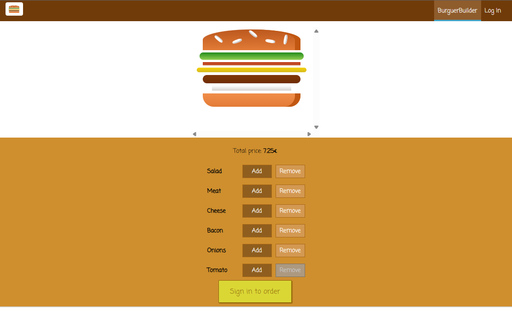

# 🍔 React Burger Builder


A **React application** that allows users to build a custom burger by dynamically adding or removing ingredients.

The interface updates **in real time**, calculating the burger price based on the selected ingredients while demonstrating **component architecture, Redux state management, and conditional rendering**.

🔗 **Live Demo**  
https://react-burger-builder-mu.vercel.app/

---

# 📸 Preview



# 🎬 Demo


---

# ✨ Features

- Add and remove burger ingredients
- Dynamic UI updates based on selected ingredients
- Automatic ingredient price calculation
- Conditional rendering for order state
- Modular and reusable component structure
- Global state management using Redux
- Simple and intuitive UI

---

# 🛠 Tech Stack

**Frontend**

- React
- Redux
- React Router
- JavaScript
- CSS

**Tooling**

- Vite
- npm
- Vercel (deployment)

---

# 📁 Project Structure

```
src/
│
├── components
│   ├── Burger
│   ├── UI
│   └── Navigation
│
├── containers
│   └── BurgerBuilder
│
├── assets
│
├── store
│   ├── actions
│   ├── reducers
│   └── store.js
│
├── App.js
└── index.jsx
```

This structure separates:

- **UI components**
- **Application containers**
- **Global state logic (Redux)**

making the project easier to scale and maintain.

---

# 🧠 Redux State Management

The application uses **Redux** to centralize the burger state.

### Global State Example

```js
{
  ingredients: {
    salad: 1,
    bacon: 1,
    cheese: 2,
    meat: 1
  },
  totalPrice: 7.40,
  purchasable: true
}
```

### Actions

Redux actions control how the burger changes.

Examples:

```
ADD_INGREDIENT
REMOVE_INGREDIENT
SET_INGREDIENTS
```

### Data Flow

```
User Click
   ↓
Dispatch Action
   ↓
Reducer updates state
   ↓
React components re-render
```

This architecture ensures predictable state changes and clean UI updates.

---

# 🚀 Run Locally

Clone the repository

```bash
git clone https://github.com/AdrianaAC/react-burger-builder.git
```

Navigate to the project folder

```bash
cd react-burger-builder
```

Install dependencies

```bash
npm install
```

Start the development server

```bash
npm run dev
```

Build the production version

```bash
npm run build
```

The app will run at:

```
http://localhost:3000
```

---

# 🎯 Learning Goals

This project was built to practice:

- React component architecture
- Global state management with Redux
- Dynamic UI rendering
- Managing application state
- Building scalable frontend structures
- Deploying frontend applications

---

# 🔎 GitHub SEO Keywords

react project  
react burger builder  
redux state management example  
react portfolio project  
frontend developer portfolio  
react dynamic ui example  
vite react project  

These keywords help recruiters and developers discover the repository.

---

# 🚀 Possible Future Improvements

If this project were expanded further, the following improvements could be implemented:

### Backend Integration

- Connect to a backend API to save orders
- Persist ingredients and orders in a database

### Authentication

- User login system
- Order history per user

### UI Enhancements

- Animations for ingredient stacking
- Better mobile responsiveness
- Drag-and-drop ingredient builder

### Testing

- Unit tests with **Jest**
- Component tests with **React Testing Library**

### Performance

- Lazy loading components
- Code splitting

These improvements would move the project closer to a **production-grade application**.

---

# 👩‍💻 Author

**Adriana Alves**

Frontend Developer focused on building **clean, scalable, and user-friendly web applications**.

GitHub  
https://github.com/AdrianaAC

LinkedIn  
https://www.linkedin.com/in/adrianaalves098/

---

⭐ If you found this project interesting, feel free to **star the repository**.
